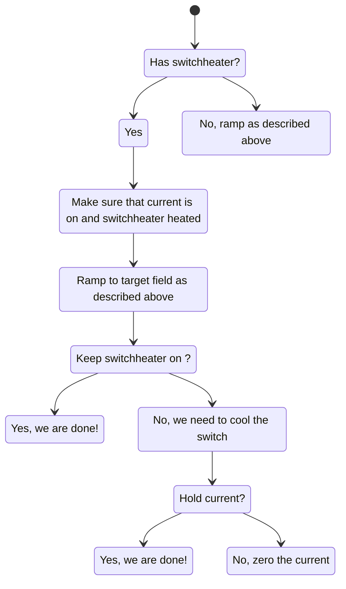
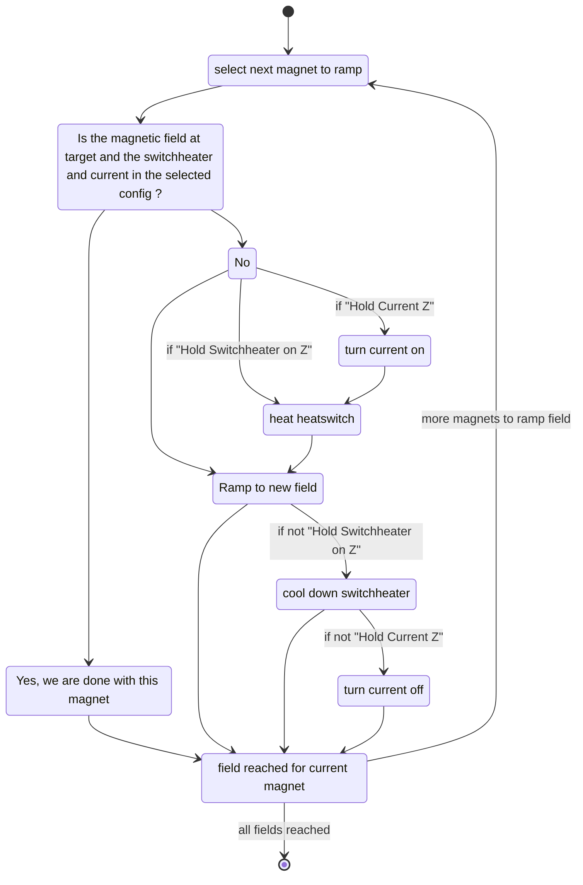
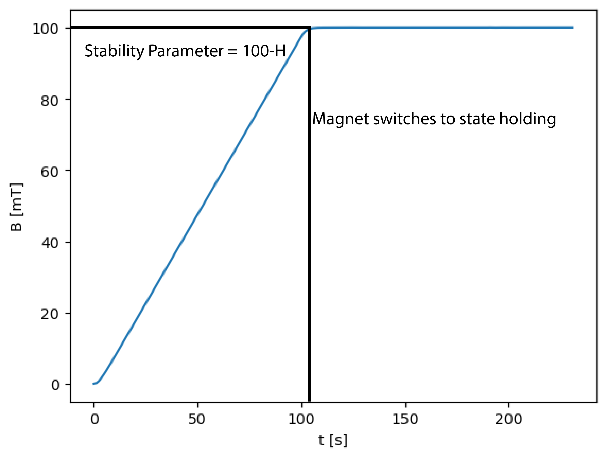
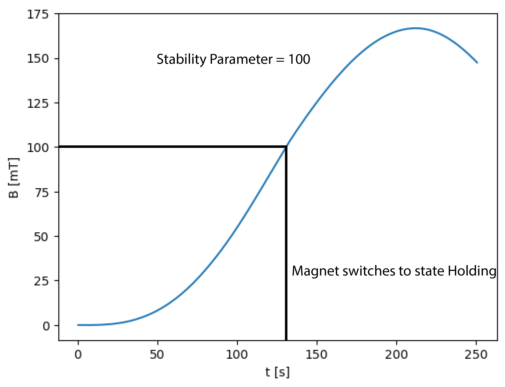

# User Manual

## Features

* Magnets X, Y, Z
* Magnets Y, Z
* Field limits may be configured and the driver ensures they are met.
* Heat switch on <-> off
* Zero current on <-> off
* Extensive diagnostics information may be extracted from the labber logfile: The correct functioning of the driver may be analysed using jupyter notebook and matplotlib.

## Labber Instrument Settings

| Category | Name | Values | Comment |
| - | - | - | - |
| `Config` | `Axis` | [AXIS2,AXIS3] | - |
| `Control` | `Logging` | [DEBUG,INFO,WARNING] | - |
| `Control` | `Mode` | [PASSIVE,RAMPING_WAIT] | see below |
| `Control` | `Labber State` | many | see below |
| `Control` | `Field Setpoint X, Y, Z` | float | [T] target field |
| `Control` | `Hold Switchheater on Z` | [False, True] | False: cool down switchheater (slow) |
| `Control` | `Hold Current Z` | [False,True] | If switchheater is cold: True: hold current False: do zerocurrent |
| `Control` | `Ramp Rate X, Y, Z` | float | [T/s] ramping speed |
| `Status` | `Switchheater Status Z` | [OFF, ON] | current state of the switchheater |
| `Status` | `Field actual X, Y, Z` | float | measured field [T] |
| `Status` | `Magnet State X, Y, Z` | many | see below |

### Control / Mode

**TODO: describe/review**

| Name | comment |
| - | - |
| `PASSIVE` | When updating `Control | Field Setpoint X, Y, Z` in Labber, the magnets will not be ramped to the new setpoint. This is useful when controlling labber manually. |
| `RAMPING_WAIT` | This mode has to be used during an experiment: After `Control | Field Setpoint X, Y, Z` has been changed, the ramping to the new filed will start. The experiment will wait (hangs) till the ramping is finished.|

### Control / Labber State

**TODO: describe/review**

The code implementing this table is implemented in `class LabberState()` in `AMI430_visa.py`.

| Name | set by | comment |
| - | - | - |
| `RAMPING` | Labber | Labber driver will return immediately and start ramping towards the “field setpoint”. As soon as “field setpoint” is reached: switch to HOLDING |
| `HOLDING` | Magnet | |
| `PAUSED` | Labber | Labber driver will return immediately and stop ramping |
| `IDLE` | Magnet | ... |
| `MISALIGNED` | Magnet | The three magnets are NOT in the same state. As long a s the state is misaligned Labber can not measure the log channels. |
| `ERROR` | Magnet | At least one magnet is in error state |

### Status | Magnet State X, Y, Z

**TODO: describe**

See [Programmer Manual](manuals/mn-430-rev10.pdf)
 * table "Ramp modes and descriptions"
 * table "Return Values and Meanings for `STATE?` Query" 

Possible states:
 * `RAMPING`
 * `HOLDING`
 * `PAUSED`
 * `MANUAL_UP`
 * `MANUAL_DOWN`
 * `ZEROING_CURRENT`
 * `QUENCH_DETECTED`
 * `AT_ZERO_CURRENT`
 * `HEATING_SWITCH`
 * `COOLING_SWITCH`

## Statemachines

In the following section we explain how we use statemachines to control the 2D/3D magnets. Before we go into details lets make the following definition. 
We call the set of the two 2/3 magnet axis a station. 

To change the 2D/3D setpoint of a station we use two state machines. The station state machine and the magnet state machine. 
Their functions are explained in more detail below.
### Station State machine

For the station state machine we have to take of two imporant aspects. 
* Magnets are always ramped in sequence (and not in synchronous mode. This would limit the ramp rates a lot). Rationale: Simplify driver and up to now we don't observe effects that would differentiate with which path we achieve a field vector.
* When ramping fields we sort the list of the magnets to be ramped. The magnets which increase the field will be choosen last. Rationale: Avoid overshoot field limits.

The Station state machine takes care of this. It first determines the order with wich we will ramp the magnets. Then it makes sure, that each magnet in the station is correctly ramped. The ramping of each magnet is implemented in the Magnet Statemachine. 

The interplay with Labber worsk the following way: The labber driver is implemented such that it only maeasures a point once the state of all 2/3 magnets is in a holding state (meaning the ramping is done). Before, the state of the station is misalgined (some or all magnets still need to be ramped). 

### Magnet Statemachine 

To change the field in a magnet without switch heater the following sequence of steps is taken: 

1. Check if the setpoint really changed. 
2. Pause the magnet
3. Set the new set point and make sure the field limits are not violated. 
4. Ramp to the setpoint. 
5. When the setpoint is reached the magnet changes to the holding state. The state machine for this magnet is finished. And the magnet wil drop from the list of magnets to be ramped in the state machine. 

A magnet with a switch heater is more complicated. Namely we have more options. After we are done ramping we can eather keep the switch heater on or not. In case the switch heater is cooled, we can also decied to ramp the current to zero or not. 
If we now want to ramp to an other point in magnetic field we have to make sure that we first ramp the current back up and heat the switch heater before we can change the applied magnetic fiedld. 



The interplay of both state machines is visualized in the state diagram below. 


A little side note for the expert user: 
When the driver starts and the switchheater is cold: Even though the field is not changed, switchheater is always heated up and the field ramped. Rationale: The driver does not yet know the state of the system. We first need to ramp the current and heat the switch to initialize into a state we know.


# The labber driver 

The labber driver handles the communication of labber and the magnet programmers. The labber driver opens a thread, that manages the communciations between Labber and the logging described below. The thread ensures that no synchronization issues arise when Labber and the Log symulateously try to communicate with the AMI 430 programmer.

# The log file

The motivation behind the log file is first for easier debuging and equally important to check the stability of the magnetic field. To motivate this we need to go further into the details of the AMI430 programmer module. 

It uses some PID type controller to reach the desired magnetic field setpoint. One does not have a direct control over the indivudual PID settings of the magnet. The handle to this controller is the stability parameter. It is a number between 0 and 100. According to the manual it is defined as follows: 


```python 
    @property
    def stability_parameter(self) -> float:
        if self.has_switchheater:
            return 0.0
        return 100.0 - self.inductance_H
```
By default, the AMI 430 programmer initializes the stability parameter to 0. 
The pictures below shows how the magnet approaches a setpoint of 100mT with (left) the correct stability setting and (right) a stability setting of 100.


|  | |
| --- | --- |


From the pictures above we see that the stability of the magnetic field heavily depends on these settings and the even bigger problem is, that the AMI430 problem switches to the Holding state even though the field has not yet stabilized. For this reason we want to be able to log the B(t) curve of the magnet. The driver has the ability to log commands and queries sent to the magnet. These commands are continiously stored in a log file. Unfortunately we can not attach a log file for each measurement as we do not have the ability to determine when labber starts a new measurement and what its name is. 

The logging depth of the driver has three settings as described above. Debug, Info and Warning.

* DEBUG: The debug level contains all the log messages. 
* INFO: We store all necessary information to analyze the log file. 
* WARNING: Only warnings are stored. 

With the logger INFO depth we log commands of the following structure. 

Timestamp Severity Tag Message

Severity Determined by the log level (DEBUG, INFO, WARNING)

Tag: Element of the LoggerTag class, see bleow. 

```python 
class LoggerTags(EnumMixin, enum.Enum):
    MAGNET_FIELD = enum.auto()
    MAGNET_STATE = enum.auto()
    LABBER_STATE = enum.auto()
    AMI430State = enum.auto()
    MAGNET_RAMPING_STATE = enum.auto()
    LABBER_SET = enum.auto()
    STATION_RAMPING_STATE = enum.auto()
    RAMPING_DURATION_S = enum.auto()
```

Message: The messages are individual for each logger tag

## Visualizing the Log messages

The data in the log file can be parsed and plotted using the AMI430_logparser and logplotter. An example code is presented in the AMI430_logplotter.ipynb .  At the moment we differentiate the following 5 data types. 

* Magnetic Field 
* State of the Magnet 
* Labber State 
* Ramping Duration 
* Setpoint

The plotter class takes care of initializing the correct data frames and parse the log file. As an Input it needs to know if it is a two or three axis magnet (Axis.AXIS3 or Axis.AXIS2), the path to the logfile and if wished a timewidnow in string format. 


