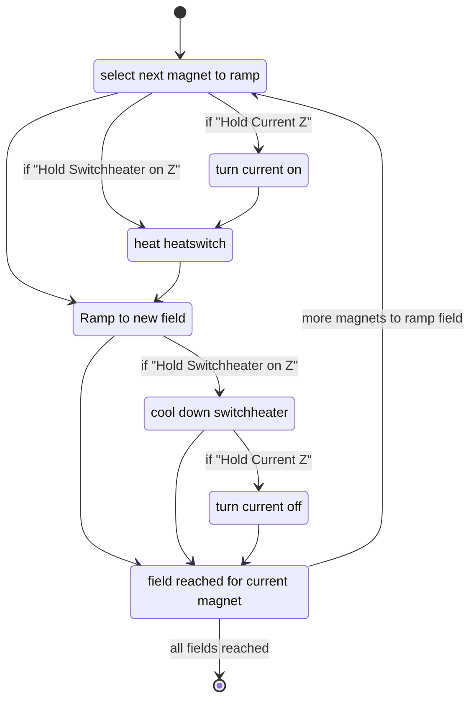

# User Manual

## Features

* Magnets X, Y, Z
* Magnets Y, Z
* Field limites may be configured and the driver ensures they are met.
* header switch on <-> off
* zero current on <-> off
* Extensive diagnostics information may be extracted from the labber logfile: The correct functioning of the driver may be analysed using jupyter notebook and matplotlib.

## Labber Instrument Settings

| Category | Name | Values | Comment |
| - | - | - | - |
| `Config` | `Axis` | [AXIS2,AXIS3] | - |
| `Control` | `Logging` | [DEBUG,INFO,WARNING] | - |
| `Control` | `Mode` | [PASSIVE,RAMPING_WAIT] | see below |
| `Control` | `Labber State` | many | see below |
| `Control` | `Field Setpoint X, Y, Z` | float | [T] target field |
| `Control` | `Hold Switchheater on Z` | [False, True] | True: cool down switchheater (slow) |
| `Control` | `Hold Current Z` | [False,True] | If switchheater is cold: True: hold current False: do zerocurrent |
| `Control` | `Ramp Rate X, Y, Z` | float | [T/s] ramping speed |
| `Status` | `Switchheater Status Z` | [OFF, ON] | current state of the switchheater |
| `Status` | `Field actual X, Y, Z` | float | actual field |
| `Status` | `Magnet State X, Y, Z` | many | see below |

### Control / Mode

**TODO: describe/review**

| Name | comment |
| - | - |
| `PASSIVE` | When updating `Control | Field Setpoint X, Y, Z` in Labber, the new field will NOT be applied. This is useful when controlling labber manually. |
| `RAMPING_WAIT` | This mode has to be used during an experiment: After `Control | Field Setpoint X, Y, Z` has been changed, the new field will be applied the the experiment will wait (hangs) till ramping has finished. |

### Control / Labber State

**TODO: describe/review**

The code implementing this table is implemented in `class LabberState()` in `AMI430_visa.py`.

| Name | set by | comment |
| - | - | - |
| `RAMPING` | Labber | Labber driver will return immediately and start ramping towards the “field setpoint”. As soon as “field setpoint” is reached: switch to HOLDING |
| `HOLDING` | Magnet | |
| `PAUSED` | Labber | Labber driver will return immediately and stop ramping |
| `IDLE` | Magnet | ... |
| `MISALIGNED` | Magnet | The three magnets are NOT in the same state |
| `ERROR` | Magnet | At least one magnet is in error state |

### Status | Magnet State X, Y, Z

**TODO: describe**

See [Programmer Manual](manuals/mn-430-rev10.pdf)
 * table "Ramp modes and descriptions"
 * table "Return Values and Meanings for `STATE?` Query" 

Possible states:
 * `RAMPING`
 * `HOLDING`
 * `PAUSED`
 * `MANUAL_UP`
 * `MANUAL_DOWN`
 * `ZEROING_CURRENT`
 * `QUENCH_DETECTED`
 * `AT_ZERO_CURRENT`
 * `HEATING_SWITCH`
 * `COOLING_SWITCH`

## Changing field -> Statemachine

The statemachine below might look difficult.

These are the key concepts:
* Magnets are always ramped in sequence (and not in parallel which would be faster). Rationale: Simplify driver.
* When ramping fields, the magnets are choosen first, which lowers there field. The magnets which upper the file will be choosen last. Rationale: Avoid overshoot field limits.
* For zerocurrent, the switchheater must be cool.
* Before heating the switchheater, current must be applied. Rationale: Avoid quench.

When the driver starts and the switchheater is cold: Even though the field is not changed, switchheater is always heated up and the field ramped. Rationale: Assure the correct field is applied.

